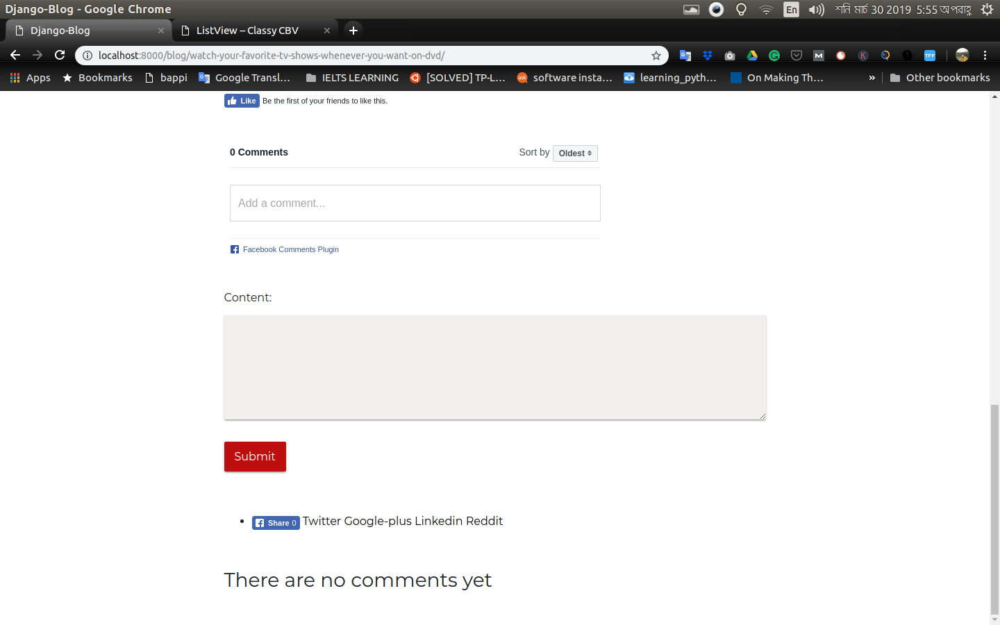

A django class based views blog with the following  features

1. CRUD functionality 
2. Both facebook and super user commenting 
3. Post can saved as draft for future published 
4. A simple custom dashboard - will be upgrade later 
5. Slug title
6. Search 
7. Read post based on user and certain category  


## Setup In Local Machine

First step- Create a directory or folder for the project where you want to copy this in your local machine.


Open the empty directory or the project folder in an editor and then open the CLI of the editor .
In the CLI make sure you are in your exact path of the folder or directory 
Clone this project or fork and clone your fork url and paste it in the CLI and hit enter

```
git clone https://github.com/bappi2016/django_blog.git

```
Then go to the project root directory, here the name is 

```
cd django_blog
```
Here the django_blog is the project root directory 

Second Step- Create a virtual environment in your current directory for this project and activate it
Make sure you are in the project root directory that is 

```
pip3 install --upgrade pip
sudo pip3 install virtualenv 
python3 -m venv ./venv
``` 
. is used for referring the current directory.
Here ./venv will create a virtual environment is this current project directory what exactly we want
Check there is a folder or directory created inside the django_startup project directory
Now activate the virtual environment.

```
source venv/bin/activate
```
If virtual environment successfully activated it will show something like the following line in you CLI
(venv) bappi@bappi-pc:~/DJANGO_FOLDER/ 


Now run and install django 

```
pip install django 
``` 
Check the version of django 

```
python -m django –version
```


Migrate the databases ...


```
python3 manage.py migrate
```

8. Start django server locally
```
python3 manage.py runserver
```

9. Visit http://127.0.0.1:8000/ in a web browser to see the following webpage.

<p align="center">
    
</p>
<p align="center">
    
</p>
<p align="center">
    
</p>
<p align="center">
    
</p>

<p align="center">
    
</p>


10. Quit the server with CONTROL-C in terminal 
```shell
CONTROL-C
```   
## How to use admin panel to manage contents

1. First create a superuser
```shell
python3 manage.py createsuperuser
```
2. Now run the server again
```shell
python3 manage.py runserver
```


now go to http://localhost:8000/admin ....
type your name and password and login 
	

4. Now Click on the models to see the tables.


